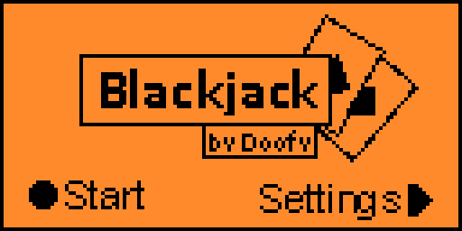
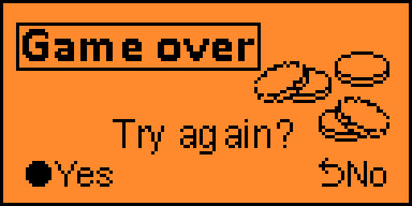

# Blackjack for Flipper Zero
Place the blackjack.fap file on your SD card in the apps folder

## Building

> The app should be compatible with the official and custom flipper firmwares. If not, follow these steps to build it
> yourself

* Download your firmware's source code
* Put the blackjack folder inside the firmware's applications_user folder
* Make sure you can use
  the [Fipper build tool](https://github.com/flipperdevices/flipperzero-firmware/blob/dev/documentation/fbt.md)
  * open a console, navigate inside the firmware folder, then run:
    #### on Linux
    > ./fbt
    #### on Windows
    > fbt.cmd

* To build the project, type this into your console:
  #### Linux
  > ./fbt fap_blackjack
  #### Windows
  > fbt.cmd fap_blackjack
* the finished build will be in the following location, copy this into your SD card:
  > build\f7-firmware-D\.extapps\blackjack.fap